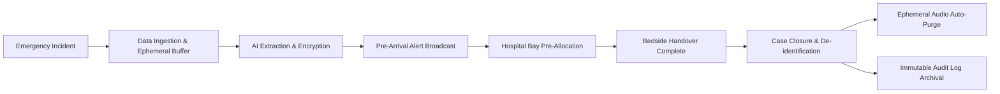
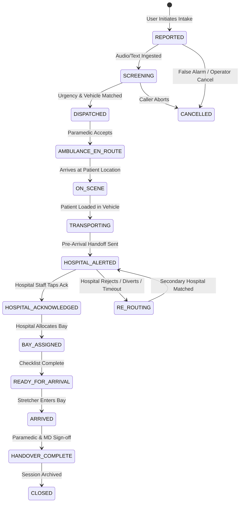
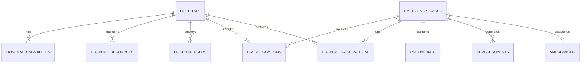

# Product Requirements Document (PRD)

# LifeSync: AI-Powered Pre-Hospital Emergency Coordination & Hospital Readiness Platform

**Document Version:** 1.2.0  
**Status:** Approved for Implementation & Hackathon Demonstration  
**Maturity Tier:** Hackathon MVP Specification & Future Architecture Blueprint  
**Authors:** LifeSync Product, Clinical Informatics & Systems Architecture Group  
**Target Release:** Q3 2026 Hackathon MVP / Research Prototype  

---

## 1. Project Overview & System Architecture

**LifeSync** is an AI-assisted pre-hospital emergency coordination and operational decision-support platform engineered to eliminate the critical information and coordination gap between emergency incident scenes, responding Emergency Medical Services (EMS) / ambulance units, and receiving hospital Emergency Departments (EDs).

### Core Principle
> **“Critical emergency information should reach the hospital before the patient does.”**

In conventional emergency response environments, emergency departments operate in a reactive state—often discovering severe patient acuity (such as acute airway compromise, massive hemorrhage, STEMI, or stroke) only when the stretcher crosses the hospital threshold. LifeSync introduces a synchronized pre-hospital data layer that connects three first-class operational interfaces across the emergency continuum:

```
+─────────────────────────────────────────────────────────────────────────────+
|                         LIFESYNC THREE-PORTAL TOPOLOGY                      |
+─────────────────────────────────────────────────────────────────────────────+
|                                                                             |
|  [ 1. Citizen / Bystander Portal ]                                          |
|  • Voice / Text / Tap Multimodal Intake                                     |
|  • Automatic GPS & Landmark Pinpointing                                     |
|  • Real-Time Emergency Status Tracking                                      |
|                                │                                            |
|                                ▼                                            |
|  [ LifeSync Core Coordination & AI Structuring Engine ]                     |
|  • NLP Clinical Entity Extraction • Deterministic Urgency Screening        |
|  • Intelligent Multi-Factor Hospital Match • Simulation & Routing Hub       |
|                                │                                            |
|       ┌────────────────────────┴────────────────────────┐                   |
|       ▼                                                 ▼                   |
|  [ 2. EMS / Paramedic Portal ]             [ 3. Hospital Readiness Portal ]  |
|  • In-Cab Route Navigation & Scene Notes   • Real-Time Incoming Case Queue  |
|  • On-Scene Clinical Vitals Update         • Pre-Arrival Handoff Review     |
|  • Live Transit Telemetry Broadcast        • 1-Click Bay & Team Allocation  |
|                                                                             |
+─────────────────────────────────────────────────────────────────────────────+
```

### High-Level Emergency Coordination Flow
$$\text{Emergency Scene} \longrightarrow \text{LifeSync Core} \longrightarrow \text{Ambulance / EMS} \longrightarrow \text{Hospital Portal} \longrightarrow \text{Hospital Readiness} \longrightarrow \text{Patient Arrival} \longrightarrow \text{Clinical Handover}$$

### Safety & Clinical Governance Boundary
LifeSync is explicitly designed as an **AI-assisted coordination, data structuring, and operational readiness tool**. It is **not** an autonomous medical diagnostic device, clinical decision-maker, or automated treatment prescribing system. The **Hospital Portal** is responsible for **pre-arrival coordination, bay staging, and resource readiness**, not automated clinical decision-making. All medical determinations, triage categorizations, and clinical care pathways remain the strict responsibility of certified human healthcare professionals, paramedics, and emergency physicians.

---

## 2. PRD Purpose & System Maturity Framework

The purpose of this PRD is to define an exhaustive, technically realistic, and implementable specification for LifeSync. It serves as the single source of truth for UI/UX engineering, backend architecture, AI data strategy, safety governance, and hackathon demonstration.

### System Maturity Classification

| Maturity State | Definition & Operational Boundary |
| :--- | :--- |
| **Concept** | The architectural philosophy, theoretical coordination protocols, and macro-vision of unified pre-hospital data continuity. |
| **Proposed System** | The comprehensive technical specification of algorithms, service interfaces, database schemas, and workflows outlined in this document. |
| **Hackathon MVP** | The scoped, executable proof-of-concept prototype built for live demonstration, using simulated vehicle telemetry, synthetic patient profiles, curated hospital capability databases (5 demo hospitals), and local sandbox APIs. |
| **Future Production** | The enterprise-grade, certified clinical deployment featuring direct CAD (Computer-Aided Dispatch) integration, live EHR/HL7 FHIR hospital bridges, certified ambulance hardware telemetry, and regional emergency governance. |

---

## 3. Executive Summary

| Attribute | Specification |
| :--- | :--- |
| **Product Name** | **LifeSync** |
| **Tagline** | *AI-Powered Pre-Hospital Emergency Coordination & Hospital Readiness Platform* |
| **The Core Problem** | Pre-hospital emergency data is fragmented, delayed, and unstructured. Emergency departments learn about critical patient conditions only when the ambulance arrives at the bay, wasting vital "Golden Hour" preparation time. |
| **The Solution** | A unified coordination ecosystem featuring Citizen Intake, Paramedic Telemetry, and a dedicated **Hospital Emergency Readiness Portal** that delivers structured clinical handoffs, screens urgency, matches optimal receiving facilities, and alerts hospital teams in advance. |
| **Target Users** | Citizens/Bystanders, Patients, Ambulance Paramedics/EMS Crews, Hospital ED Coordinators, Triage Nurses, Emergency Physicians & Trauma Leaders. |
| **Key Innovation** | Natural language / multi-dialect speech structuring combined with deterministic safety screening, multi-factorial hospital suitability matching, and 1-click hospital bay/resource staging. |
| **Expected Impact** | Substantial reduction in hospital pre-arrival notification latency, structured readiness for resuscitation/cath-lab/stroke teams prior to patient arrival, and reduced secondary inter-hospital transfers. |

### Core Positioning Statement
> **“LifeSync synchronizes critical emergency information across the emergency scene, ambulance, and hospital so that the receiving medical team can be informed and prepare before the patient arrives.”**

---

## 4. Hackathon MVP Scope & Boundaries

```
+─────────────────────────────────────────────────────────────────────────────+
|                         HACKATHON MVP SCOPE MATRIX                          |
+─────────────────────────────────────────────────────────────────────────────+
|  [ MUST BUILD (Core Demo Deliverables) ]                                    |
|  1. Multimodal Intake (Voice / Text / 1-Tap Category buttons)               |
|  2. Speech-to-Text Pipeline (Web Audio -> Whisper transcription)            |
|  3. NLP Clinical Entity Extraction (Age, Sex, Complaint, Onset, Vitals)     |
|  4. Deterministic Urgency Screening (Red / Yellow / Green Rules)            |
|  5. Simulated Ambulance Dispatch & Vector Telemetry Tracking                |
|  6. Curated Hospital Registry (5 Synthetic Hospitals with Capabilities)     |
|  7. Multi-Factorial Hospital Suitability Matching Engine                     |
|  8. Standardized Digital Pre-Arrival Emergency Handoff Packet               |
|  9. Dedicated Hospital Emergency Readiness Portal (Screens H1–H7)           |
|  10. Hospital 1-Click Acknowledgement & Bay Allocation                      |
|  11. Hospital Reject / Diversion Workflow with Required Reason Codes        |
|  12. Paramedic En-Route Vitals Update -> Hospital Live Sync                |
|  13. Human Recommendation Override with Audit Trail                         |
|  14. End-to-End State Machine Engine (REPORTED -> ARRIVED -> CLOSED)        |
|  15. Interactive Scenario Simulation Suite (5 Pre-Packaged Cases)           |
|                                                                             |
|  [ SHOULD BUILD (Secondary Polish) ]                                        |
|  • Multilingual / Hinglish Speech Understanding                             |
|  • AI Extraction Confidence & Uncertainty Badges                            |
|  • Missing-Information Micro-Prompts on Intake                              |
|  • Hospital Capacity & Resource Readiness Checklists                        |
|  • Notification Timeout & Multi-Tier Escalation Simulation                  |
|                                                                             |
|  [ OUT OF SCOPE FOR HACKATHON ]                                             |
|  • Real 112 / 108 / 911 Municipal CAD Integration                          |
|  • Real Ambulance OBD-II / CAN-Bus Telemetry Hardware                       |
|  • Live Hospital EHR / HL7 FHIR Production Bridges (Epic/Cerner)            |
|  • Live ICU / Cath-Lab Sensor Feeds                                         |
|  • Autonomous Medical Diagnosis or Drug Prescriptions                       |
|  • Real Patient PHI / Live Hospital Operational Data                        |
+─────────────────────────────────────────────────────────────────────────────+
```

---

## 5. Assumptions & External Dependencies

| Component / Dependency | Hackathon MVP Status | Future Production Integration |
| :--- | :--- | :--- |
| **Hospital Capability Database** | **Curated / Synthetic DB** (5 demo hospitals) | Live State Hospital Registry / ABDM Health Facility Registry |
| **Ambulance Fleet & GPS** | **Programmatic Simulation Engine** | Real-Time Hardware GPS / Regional CAD Fleet API |
| **Transit Traffic & ETAs** | **Algorithmic Vector Simulator** | Live Mapbox / Google Maps Distance Matrix API |
| **Hospital ED Staff Actions** | **Interactive Hospital Portal UI** | Hospital EDIS Single Sign-On & In-Bay Terminals |
| **Patient Clinical Profiles** | **100% Synthetic Demo Personas** | Patient-Consented Electronic Health Records (ABHA / PHR) |
| **Emergency Dispatch Hook** | **Internal Event Bus** | Government National Emergency Response System (NERS 112) |
| **Clinical Structuring AI** | **Local Transformers / Sandbox NLP** | Certified On-Premises Medical NLP Microservice |

---

## 6. AI/ML Data Strategy & Evaluation

```
+─────────────────────────────────────────────────────────────────────────────+
|                         AI / ML DATA LIFECYCLE                              |
+─────────────────────────────────────────────────────────────────────────────+
|  [ MVP PROTOTYPE DATA SOURCES ]                                             |
|  • Pretrained Open-Source Speech Models (OpenAI Whisper / IndicWav2Vec)      |
|  • 250+ Synthetic Emergency Utterances (Transcripts of simulated calls)     |
|  • Curated Medical Lexicon & Symptom Ontology (SNOMED-CT / ICD-10 aligned)  |
|  • Curated Benchmark Test Suite (50 Golden Test Cases with Ground Truth)    |
|                                                                             |
|  [ FUTURE PRODUCTION DATA PIPELINE ]                                        |
|  • Institutionally IRB-approved, de-identified emergency call recordings    |
|  • Expert-annotated multi-dialect pre-hospital audio corpora                 |
|  • Multi-center clinical audit datasets for urgency calibration             |
+─────────────────────────────────────────────────────────────────────────────+
```

* **Golden Benchmark Corpus ($N=50$):** Curated synthetic emergency transcripts covering cardiac, trauma, stroke, respiratory, pediatric, and toxicological presentations.
* **Evaluation Targets:** Clinical Entity F1-Score $\ge 0.90$; Zero-Tolerance Under-Triage on Red-Rule test cases ($0.00\%$ failure rate).

---

## 7. AI vs. Deterministic Rule-Based Architecture

LifeSync strictly separates probabilistic language interpretation from deterministic, safety-critical operational rules.

```
VOICE / TEXT INTAKE
        ↓
Automatic Speech Recognition (AI/ML)
        ↓
Language Normalization & Translation (AI/ML)
        ↓
Clinical Entity Extraction (AI/NLP)
        ↓
Structured Emergency JSON Representation
        ↓
Pydantic Type & Range Validation (Deterministic)
        ↓
Tier 1: Red-Line Safety Rule Engine (Deterministic)
        ↓
Tier 2: Multi-Factor Acuity Classifier (Algorithmic)
        ↓
Hospital Suitability Matching Algorithm (Cost Function)
        ↓
Pre-Arrival Handoff Generation (Template / FHIR-Aligned)
        ↓
Hospital Emergency Readiness Portal (Human Review & Bay Staging)
```

> **CORE GOVERNANCE PRINCIPLES:**  
> 1. **AI interprets and structures** raw language into clean parameters.  
> 2. **Deterministic rules control safety-critical urgency escalation** (e.g., "unconscious" = Immediate RED).  
> 3. **Humans retain total final authority** over clinical diagnoses and operational routing.

---

## 8. User Roles & Role-Based Access Control (RBAC)

```
+─────────────────────────────────────────────────────────────────────────────+
|                         ROLE-BASED ACCESS CONTROL                           |
+─────────────────────────────────────────────────────────────────────────────+
```

| Role | Authentication Method | Accessible Views | Permissions & Allowed Actions | Guardrails / Restricted Actions |
| :--- | :--- | :--- | :--- | :--- |
| **Citizen (Bystander/Patient)** | Anonymous Token / Guest Session | Emergency Intake, Live Status Tracker | Submit emergency, record voice/text, view assigned ambulance ETA | Cannot view hospital capacity or other incidents |
| **EMS / Paramedic** | Secure PIN / Mobile Session | Paramedic Tablet, Route Navigation | Update on-scene vitals, view patient notes, confirm physical handover | Cannot reassign other vehicles or modify hospital rosters |
| **Hospital ED Coordinator** | Demo Login / JWT (SSO in Prod) | Hospital Dashboard, Bay Allocation | Acknowledge alert, reject/divert case, allocate bays, alert teams | Cannot alter core triage safety rules or dispatch logic |
| **Emergency Physician** | Demo Login / JWT (SSO in Prod) | Pre-Arrival Handoff, Clinical Detail | Review clinical graph, inspect vitals trends, sign-off handover | Read-only access to dispatch routing algorithms |
| **Hospital Administrator** | Admin Credentials | Hospital Settings, Resource Config | Configure simulated bay counts, view facility audit logs | Cannot modify active clinical triage parameters |
| **Regional Dispatcher** | Role-Based Web Login | Regional Command Center, Fleet Map | System-wide operational case view, manual mutual-aid override | Cannot alter patient clinical records |

---

## 9. Data Lifecycle, Consent & Privacy Architecture



* **Data Minimization:** No non-essential identity, financial, or insurance data collected during acute intake.
* **Ephemeral Audio Purge:** Raw caller voice audio buffers are wiped from system memory within 15 minutes post-transcription.
* **Synthetic Standard for MVP:** 100% synthetic patient and hospital data. No real PHI is processed.
* **Regulatory Alignment:** Designed in structural alignment with India's **DPDPA 2023** and **ABDM** standards.

---

## 10. Intelligent Hospital Matching & Diversion Logic

The Hospital Matching Engine balances clinical needs, transit times, and operational readiness, incorporating automated diversion handling.

```
+─────────────────────────────────────────────────────────────────────────────+
|                       HOSPITAL MATCHING & DIVERSION FLOW                    |
+─────────────────────────────────────────────────────────────────────────────+
|  Incident Coordinates + Extracted Clinical Needs                            |
|        │                                                                    |
|        ▼                                                                    |
|  [ Filter 1: Clinical Capability Match ]                                    |
|  (e.g., Requires 24/7 Cath Lab for STEMI, Level-1 Trauma for Poly-Trauma)  |
|        │                                                                    |
|        ▼                                                                    |
|  [ Filter 2: Operational & Diversion Check ]                                |
|  (Hospital Status == OPERATIONAL and Diversion == FALSE)                    |
|        │                                                                    |
|        ▼                                                                    |
|  [ Compute Multi-Factor Suitability Score S(C, H) ]                         |
|  S(C, H) = [ w_cap * C_match + w_time * T_score + w_bed * B_avail ] * M_crit|
|        │                                                                    |
|        ▼                                                                    |
|  Ranked Recommendations Output with Plain-Text Justification                |
|        │                                                                    |
|        ├── [ Target Hospital Acknowledges ] ──> Lock Destination & Stage Bay|
|        │                                                                    |
|        └── [ Target Hospital Rejects/Diverts ] ─────────────────────────────|
|                    │                                                        |
|                    ▼                                                        |
|        LifeSync Re-runs Matching -> Selects Rank-2 Alternative              |
|        -> Generates New Pre-Arrival Alert for Secondary Hospital            |
+─────────────────────────────────────────────────────────────────────────────+
```

---

## 11. Human Override Workflow

Authorized hospital and EMS personnel retain complete authority to override algorithmic suggestions.

```
+─────────────────────────────────────────────────────────────────────────────+
|                         HUMAN OVERRIDE SPECIFICATION                        |
+─────────────────────────────────────────────────────────────────────────────+
|  Overridable Actions:                                                       |
|  1. Urgency Acuity Tier (e.g., Upgrade YELLOW -> RED or Downgrade)         |
|  2. Hospital Destination Selection (e.g., Select Alternative Hospital)      |
|  3. Ambulance Vehicle Class Assignment (e.g., Reassign BLS -> ALS)          |
|                                                                             |
|  Mandatory Override Audit Payload:                                          |
|  {                                                                          |
|    "override_id": "OVR-9921",                                               |
|    "case_id": "LS-2026-9042",                                               |
|    "actor_user_id": "HOSP-COORD-ROY-01",                                    |
|    "actor_role": "HOSPITAL_ED_COORDINATOR",                                 |
|    "parameter_overridden": "DESTINATION_HOSPITAL",                          |
|    "original_value": "HOSP-APEX-01",                                        |
|    "new_value": "HOSP-CITY-02",                                             |
|    "reason_code": "SPECIALIST_UNAVAILABLE_EMERGENCY_SURGERY",               |
|    "free_text_justification": "On-duty neurosurgeon paged to surgery",      |
|    "timestamp": "2026-09-16T14:04:12Z"                                      |
|  }                                                                          |
+─────────────────────────────────────────────────────────────────────────────+
```

---

## 12. Decision Audit Trail & Explainability

### 12.1 Decision Audit Trail
Every incident maintains a tamper-evident, append-only chronological log recording how the system structured data and why recommendations were made.

```
[14:00:01] Case Created (#LS-9042) via Bystander Web Intake.
[14:00:14] Audio stream (12.4s) received. ASR Transcript: "Father crushing chest pain..."
[14:00:16] NLP Entities Extracted: {Age: 58M, Chief: Chest Pain, Diaphoresis: True}. Confidence: 0.94.
[14:00:16] Deterministic Rule Triggered: [RULE-CARD-01: Acute Chest Pain + Diaphoresis].
[14:00:16] Urgency Assigned: HIGH_PRIORITY (RED).
[14:00:17] Ambulance Query: ALS-04 matched (Distance: 1.8km, ETA: 4m). Dispatched.
[14:00:18] Hospital Scoring: Apex Metro (Score: 94/100, CathLab: Active). St. Jude (Score: 32/100).
[14:00:19] Pre-Arrival Alert Generated. Transmitted to Apex Metro Hospital Portal.
[14:00:48] Alert Acknowledged by ED-Nurse-Roy via Hospital Portal.
[14:01:05] Trauma Bay 1 Assigned via Hospital Portal. Cath-Lab Team Pre-Alerted.
[14:03:12] EMS Paramedic updated on-scene vitals: BP 90/60, SpO2 91%, Pulse 110.
[14:03:14] Hospital Portal received verified EMS vitals update.
[14:08:12] Physical Arrival at Bay. Paramedic-MD Bedside Sign-off Completed.
[14:08:15] Case Transitioned to HANDOVER_COMPLETE. Ephemeral audio buffer purged.
```

### 12.2 Explainability Framework
* **What the system detected:** *"Crushing retrosternal chest pain (onset 20m), diaphoresis, dyspnea."*
* **Why urgency was escalated:** *"HIGH PRIORITY triggered because Acute Coronary Syndrome indicators were identified."*
* **Confidence & Uncertainty:** *"Extraction Confidence: 94%. Note: Patient age estimated from bystander voice."*

---

## 13. Emergency Case State Machine



---

## 14. Hospital Acknowledgement Failure & Escalation Logic

```
+─────────────────────────────────────────────────────────────────────────────+
|                     HOSPITAL ALERT TIMEOUT & ESCALATION                     |
+─────────────────────────────────────────────────────────────────────────────+
|  Alert Transmitted to Hospital Portal (T = 0s)                              |
|        │                                                                    |
|        ├── [ < 45s ] ──> Hospital Acknowledges: State = ACKNOWLEDGED        |
|        │                                                                    |
|        ├── [ T = 60s Unacknowledged ] ──> Tier 1: Audible Siren on Portal   |
|        │                                  + Visual Pulsing Red Banner       |
|        │                                                                    |
|        ├── [ T = 120s Unacknowledged ] ─> Tier 2: Automated SMS / Push to   |
|        │                                  ED Triage Coordinator Phone       |
|        │                                                                    |
|        └── [ T = 180s Unacknowledged ] ─> Tier 3: Dispatch Alert Triggered  |
|                                           + Prompt Paramedic for Radio Check|
|                                           + Auto-Initiate Secondary Match   |
+─────────────────────────────────────────────────────────────────────────────+
```

---

## 15. Module H — Dedicated Hospital Emergency Readiness Portal

The **Hospital Emergency Readiness Portal** is a core first-class application within LifeSync.

```
+─────────────────────────────────────────────────────────────────────────────+
|           MODULE H: HOSPITAL EMERGENCY READINESS PORTAL TOPOLOGY            |
+─────────────────────────────────────────────────────────────────────────────+
|                                                                             |
|  [ Screen H1: Hospital Login & Demo Account Selection ]                     |
|  • Secure Demo Login • Hospital Facility Picker (Hospitals A–E)             |
|                                │                                            |
|                                ▼                                            |
|  [ Screen H2: Hospital Emergency Department Dashboard ]                     |
|  • Active Incoming Case Queue  • Acuity Badges (Red/Yellow/Green)           |
|  • Live ETA Countdown Timers   • Hospital Operational & Diversion Status    |
|                                │                                            |
|       ┌────────────────────────┼────────────────────────┐                   |
|       ▼                        ▼                        ▼                   |
|  [ Screen H3: Case Detail ] [ Screen H4: Ambulance ] [ Screen H5: Bay Alloc]|
|  • Structured Handoff      • Live Moving Map Vector • 1-Click Bay Picker   |
|  • AI vs EMS Vitals Trend  • Telemetry Stream & ETA • Readiness Checklist  |
|                                │                        │                   |
|       ┌────────────────────────┴────────────────────────┘                   |
|       ▼                                                                     |
|  [ Screen H6: Case Timeline & Audit Log ]                                   |
|  • Chronological Event Stream • Recorded Timestamps & Actor Sign-offs       |
|                                                                             |
|  [ Screen H7: Hospital Operational Settings & Resource Config ]             |
|  • Configure Simulated Bays • Toggle Diversion State • View Specialties     |
|                                                                             |
+─────────────────────────────────────────────────────────────────────────────+
```

### 15.1 Hospital Portal User Roles & Capabilities
* **Hospital ED Coordinator:** Full operational access to incoming case queue, 1-click acknowledgement, case rejection/diversion with mandatory reason logging, bay allocation, readiness checklists, and alert escalation.
* **Emergency Physician / Trauma Leader:** Deep clinical review of extracted symptoms, pertinent negatives, symptom onset timestamps, baseline vitals, and verified EMS updates.
* **Hospital Administrator:** Configuration of facility operational capacity, emergency bay statuses, specialty availability toggles, and facility audit reviews.

### 15.2 Detailed Hospital Portal Screen Specifications

#### Screen H1 — Hospital Login & Facility Selector
* **Purpose:** Authenticate hospital staff and establish the active facility context.
* **Key Elements:** Facility Dropdown (Apex Metro Hospital, City General, Neurosciences Institute, Children's Emergency, Community Clinic), Role Selector (ED Coordinator, Trauma Physician, Admin), Demo Login Button.
* **Environment Notice:** Prominent persistent badge: `LIFESYNC DEMO — SYNTHETIC DATA — NOT FOR CLINICAL USE`.

#### Screen H2 — Main Hospital Dashboard (Incoming Emergency Queue)
* **Purpose:** Provide an instant 1-glance operational overview of all inbound ambulances and internal ED capacity.
* **Layout:**
```
+───────────────────────────────────────────────────────────────────────────────────────────────────+
| LIFESYNC ED PORTAL - APEX METRO HOSPITAL                                     14:06:45 | USER: DR. ROY |
+───────────────────────────────────────────────────────────────────────────────────────────────────+
| ACTIVE INCOMING (3)     RESUS BAYS: 2/4 AVAIL     TRAUMA BAYS: 1/2 AVAIL     CATH LAB: STANDBY    |
+───────────────────────────────────────────────────────────────────────────────────────────────────+
| PRIORITY | CASE ID  | PATIENT & CHIEF COMPLAINT   | EMS UNIT | ETA    | STATUS       | ACTIONS    |
+----------+----------+-----------------------------+----------+--------+--------------+------------+
| [ RED ]  | #LS-9042 | 58M - Crushing Chest Pain   | ALS-04   | 07:52  | AWAITING ACK | [ACK] [DIV]|
| [ RED ]  | #LS-9039 | 25M - Road Trauma / Bleed   | ALS-02   | 11:20  | ACKNOWLEDGED | [BAY] [DET]|
| [YELLOW] | #LS-9031 | 45M - Acute Abdominal Pain  | BLS-12   | 18:40  | ACKNOWLEDGED | [BAY] [DET]|
+───────────────────────────────────────────────────────────────────────────────────────────────────+
```

#### Screen H3 — Pre-Arrival Emergency Handoff Detail Screen
* **Purpose:** Display the complete structured clinical handoff packet for a selected emergency.
* **Content Sections:**
  1. **Patient Demographics:** Estimated age, sex, information source (Bystander vs. EMS).
  2. **Incident Context:** Location landmark, time reported, mechanism of injury.
  3. **Clinical Findings:** Chief complaint, detected symptoms, pertinent negatives, symptom onset timer, AVPU consciousness level.
  4. **AI Extraction Transparency Card:**
     * *Detection:* "LifeSync detected high-priority cardiovascular emergency indicators."
     * *Confidence:* $0.94$ extraction score.
     * *Uncertainty:* "Patient age estimated by caller. Pre-existing cardiac history unconfirmed."
  5. **EMS Verified Information Card:** Displays updated vitals entered by paramedics en-route (BP, SpO2, Heart Rate, GCS).
  6. **Hospital Action Bar:** `[ ACKNOWLEDGE CASE ]` `[ ASSIGN BAY ]` `[ REJECT / DIVERT ]` `[ HUMAN OVERRIDE ]`.

#### Screen H4 — Live Ambulance Tracking & Route Telemetry
* **Purpose:** Visualize inbound EMS transport on a map with dynamic ETA countdown.
* **Key Elements:** Map display with vehicle location marker, simulated route polyline, speed telemetry ($48\text{ km/h}$), distance remaining ($2.8\text{ km}$), destination hospital geofence, and simulation control toggle.

#### Screen H5 — Emergency Bay & Resource Allocation
* **Purpose:** Enable coordinators to reserve physical resuscitation beds and trigger specialist readiness checklists.
* **Bay Picker Grid:**
  * Resuscitation Bay 1: `AVAILABLE` $\rightarrow$ `[ ASSIGN TO #LS-9042 ]`
  * Resuscitation Bay 2: `OCCUPIED`
  * Trauma Bay 1: `AVAILABLE`
  * Trauma Bay 2: `CLEANING`
  * General ED Bay 4: `AVAILABLE`
* **Operational Readiness Checklist (Non-Prescriptive):**
  * `[✔]` Trauma / Resuscitation Team Alerted
  * `[✔]` Resuscitation Bay 1 Prepared & Monitored
  * `[✔]` Blood Bank Placed on Standby (2 Units O-Neg)
  * `[✔]` Cath-Lab / Stroke Interventionalist Paged
  * `[ ]` Specialist Confirmation Pending

#### Screen H6 — Chronological Case Timeline & Audit Trail
* **Purpose:** Display a tamper-evident chronological timeline of every event from incident reporting to bedside handover.

#### Screen H7 — Hospital Operational Settings & Resource Config
* **Purpose:** Allow demo operators to adjust simulated hospital capacity, toggle specialty availability (Cath Lab, Stroke, Trauma), and test hospital diversion workflows.

---

### 15.3 Hospital Acknowledgement Workflow
```
Alert Arrives on Portal (Audible Chime + Red Card)
                      ↓
          [ AWAITING ACKNOWLEDGEMENT ]
                      ↓
       ED Coordinator clicks [ ACKNOWLEDGE CASE ]
                      ↓
       Portal records: User ID, Timestamp, Hospital ID
                      ↓
          [ HOSPITAL ACKNOWLEDGED ]
                      ↓
       Coordinator navigates to [ BAY ALLOCATION ]
                      ↓
       Reserves Resuscitation Bay 1 -> Status: [ BAY ASSIGNED ]
                      ↓
       Checks Readiness Tasks -> Status: [ READY FOR ARRIVAL ]
```

---

### 15.4 Hospital Reject / Diversion Workflow
If a hospital cannot accept an incoming high-acuity case due to sudden operational overload or equipment failure, authorized staff can divert the case:

```
ED Coordinator clicks [ REJECT / DIVERT ]
                      ↓
Modal Prompts for Mandatory Reason Code:
• [ ] No Required Specialty Available
• [ ] Emergency Department at Maximum Surge Capacity
• [ ] CT Scanner / Cath Lab Offline for Maintenance
• [ ] Trauma Surgical Team Committed in OR
• [ ] Other (Requires text explanation)
                      ↓
Coordinator confirms diversion
                      ↓
Hospital Portal updates: Case Marked DIVERTED
                      ↓
LifeSync Core Engine instantly re-runs Hospital Matching
                      ↓
Secondary Hospital identified -> Pre-Arrival Alert transmitted to Hospital B
                      ↓
Ambulance receives revised navigation vector to Hospital B
```

---

### 15.5 EMS $\rightarrow$ Hospital Information Update Protocol
LifeSync supports dynamic en-route data refinement:

```
[ Step 1: Bystander Intake ] 
-> "Father having severe chest pain, sweating."
-> Hospital Portal displays: Initial Bystander Summary (Orange Header)

[ Step 2: Paramedic Reaches Patient ]
-> Paramedic enters physical vitals on EMS tablet: BP 85/55, HR 118, SpO2 90%.
-> Paramedic attaches 12-lead observation: "Inferior ST elevation observed."

[ Step 3: Real-Time Sync ]
-> Hospital Portal receives WebSocket push: "EMS Vitals Update Received".
-> Portal updates Case Detail screen: Verified EMS Telemetry Card (Blue Header).
-> Triage nurse upgrades bay readiness to Code STEMI Resuscitation Bay.
```

---

## 16. Curated Synthetic Hospital Registry (Hackathon MVP)

The MVP includes 5 pre-configured demo hospitals to showcase intelligent matching, specialty filtering, and diversion handling:

```
+─────────────────────────────────────────────────────────────────────────────+
|                         CURATED MVP HOSPITAL REGISTRY                       |
+─────────────────────────────────────────────────────────────────────────────+
| 1. APEX METRO SUPERSPECIALTY HOSPITAL (HOSP-01)                             |
|    • Capabilities: Level-1 Trauma, 24/7 Cath Lab, Comprehensive Stroke,     |
|      Blood Bank, Emergency Surgery, Adult ICU.                              |
|    • Resuscitation Bays: 4 Total (2 Available)                              |
|                                                                             |
| 2. CITY GENERAL HOSPITAL (HOSP-02)                                          |
|    • Capabilities: General Emergency, Level-2 Trauma, Blood Bank, Adult ICU.|
|    • Exclusions: No 24/7 Cath Lab, No Comprehensive Stroke Unit.            |
|    • Resuscitation Bays: 6 Total (3 Available)                              |
|                                                                             |
| 3. METRO NEUROSCIENCES INSTITUTE (HOSP-03)                                  |
|    • Capabilities: Comprehensive Stroke Center, 24/7 CT Angiography,        |
|      Neuro-ICU, Emergency Neurosurgery.                                     |
|    • Exclusions: No Dedicated Pediatric Unit.                               |
|    • Resuscitation Bays: 2 Total (1 Available)                              |
|                                                                             |
| 4. ST. JUDE CHILDREN'S EMERGENCY HOSPITAL (HOSP-04)                         |
|    • Capabilities: Dedicated Pediatric Emergency, Pediatric ICU (PICU),    |
|      Pediatric Surgery, Pediatric Airway Emergency.                         |
|    • Exclusions: Adult Emergency Care Excluded.                             |
|    • Resuscitation Bays: 3 Total (2 Available)                              |
|                                                                             |
| 5. COMMUNITY HEALTH CLINIC & EMERGENCY POST (HOSP-05)                       |
|    • Capabilities: Basic Emergency Stabilization, Minor Trauma, BLS Transfer.|
|    • Exclusions: No Cath Lab, No Stroke Unit, No Blood Bank, No ICU.        |
|    • Resuscitation Bays: 1 Total (1 Available)                              |
+─────────────────────────────────────────────────────────────────────────────+
```

---

## 17. 18-Step End-to-End Emergency User Journey

```mermaid
sequenceDiagram
    autonumber
    actor Bystander as Bystander / Scene
    participant App as Citizen Intake
    participant AI as LifeSync Core
    actor EMS as EMS Paramedic
    participant Hospital as Hospital Portal
    actor MD as Hospital ED Team

    Bystander->>App: Speaks: "Father collapsed, crushing chest pain, sweating"
    App->>AI: Streams audio + GPS coordinates
    AI->>AI: Extracts clinical entities & evaluates deterministic red rules
    AI->>AI: Urgency = HIGH (RED); Specialty = CATH_LAB required
    AI->>EMS: Dispatches ALS Unit 04 with pre-populated summary
    AI->>AI: Matches Apex Metro Hospital (Cath Lab Active, ETA: 8m)
    AI->>Hospital: Transmits Pre-Arrival Alert (Audible Chime on Portal)
    Hospital->>Hospital: ED Coordinator clicks [ACKNOWLEDGE CASE]
    Hospital->>Hospital: Allocates Resuscitation Bay 1 & alerts Cath Lab team
    EMS->>Bystander: Arrives on scene & begins physical stabilization
    EMS->>AI: Updates vitals: BP 90/60, SpO2 91% en route
    AI->>Hospital: Pushes verified EMS vitals update to Hospital Portal
    Hospital->>MD: Physician reviews updated clinical graph on Bay monitor
    EMS->>Hospital: Ambulance pulls into emergency bay
    EMS->>MD: Stretcher transferred into Resuscitation Bay 1
    MD->>Hospital: Paramedic & MD complete digital handover sign-off
    Hospital->>AI: Case status transitions to HANDOVER_COMPLETE -> CLOSED
```

---

## 18. Database Design & Relational Schema



### Hospital Portal Data Entities

#### 1. `HOSPITALS`
* `id` (UUID, PK): e.g., `HOSP-APEX-01`.
* `name` (VARCHAR): `Apex Metro Superspecialty Hospital`.
* `latitude` / `longitude` (DECIMAL).
* `operational_status` (Enum): `OPERATIONAL`, `DEGRADED`, `OFFLINE`.
* `diversion_status` (BOOL): `false`.
* `contact_phone` (VARCHAR).

#### 2. `HOSPITAL_CAPABILITIES`
* `hospital_id` (UUID, FK $\rightarrow$ `HOSPITALS.id`, PK).
* `has_trauma_level_1` (BOOL).
* `has_cath_lab` (BOOL).
* `has_stroke_center` (BOOL).
* `has_blood_bank` (BOOL).
* `has_pediatric_icu` (BOOL).
* `has_emergency_surgery` (BOOL).
* `updated_at` (TIMESTAMPTZ).

#### 3. `HOSPITAL_RESOURCES`
* `id` (UUID, PK).
* `hospital_id` (UUID, FK $\rightarrow$ `HOSPITALS.id`).
* `resource_name` (VARCHAR): e.g., `Resuscitation Bay 1`, `Trauma Bay 1`.
* `resource_type` (Enum): `RESUSCITATION_BAY`, `TRAUMA_BAY`, `GENERAL_ED_BAY`, `ICU_BED`.
* `status` (Enum): `AVAILABLE`, `OCCUPIED`, `RESERVED`, `CLEANING`, `MAINTENANCE`.
* `updated_at` (TIMESTAMPTZ).

#### 4. `HOSPITAL_USERS`
* `id` (UUID, PK).
* `hospital_id` (UUID, FK $\rightarrow$ `HOSPITALS.id`).
* `username` (VARCHAR).
* `full_name` (VARCHAR).
* `role` (Enum): `HOSPITAL_ED_COORDINATOR`, `EMERGENCY_PHYSICIAN`, `HOSPITAL_ADMIN`.
* `auth_token_hash` (VARCHAR).
* `is_active` (BOOL).

#### 5. `BAY_ALLOCATIONS`
* `id` (UUID, PK).
* `case_id` (UUID, FK $\rightarrow$ `EMERGENCY_CASES.id`).
* `hospital_id` (UUID, FK $\rightarrow$ `HOSPITALS.id`).
* `resource_id` (UUID, FK $\rightarrow$ `HOSPITAL_RESOURCES.id`).
* `allocated_by_user_id` (UUID, FK $\rightarrow$ `HOSPITAL_USERS.id`).
* `allocation_status` (Enum): `RESERVED`, `OCCUPIED`, `RELEASED`.
* `assigned_at` (TIMESTAMPTZ).

#### 6. `HOSPITAL_CASE_ACTIONS`
* `id` (BIGSERIAL, PK).
* `case_id` (UUID, FK $\rightarrow$ `EMERGENCY_CASES.id`).
* `hospital_id` (UUID, FK $\rightarrow$ `HOSPITALS.id`).
* `actor_user_id` (UUID, FK $\rightarrow$ `HOSPITAL_USERS.id`).
* `action_type` (Enum): `ALERT_VIEWED`, `CASE_ACKNOWLEDGED`, `CASE_REJECTED_DIVERTED`, `BAY_ASSIGNED`, `READINESS_CHECKLIST_UPDATED`, `HANDOVER_SIGNED`.
* `reason_code` (VARCHAR, Nullable): e.g., `NO_CAPACITY`, `EQUIPMENT_DOWN`.
* `notes` (TEXT, Nullable).
* `timestamp` (TIMESTAMPTZ).

---

## 19. Hospital Portal API Specifications

```
+─────────────────────────────────────────────────────────────────────────────+
|                         HOSPITAL PORTAL REST API                            |
+─────────────────────────────────────────────────────────────────────────────+
|  GET    /api/v1/hospital/cases                  --> List incoming cases     |
|  GET    /api/v1/hospital/cases/{case_id}        --> Full handoff packet     |
|  POST   /api/v1/hospital/cases/{case_id}/ack    --> 1-Click acknowledgement |
|  POST   /api/v1/hospital/cases/{case_id}/reject --> Reject / divert case    |
|  POST   /api/v1/hospital/cases/{case_id}/bay    --> Allocate specific bay   |
|  POST   /api/v1/hospital/cases/{case_id}/ready  --> Update readiness check  |
|  GET    /api/v1/hospital/resources              --> Query bay availability  |
|  GET    /api/v1/hospital/cases/{case_id}/audit  --> Chronological timeline  |
|  WSS    /api/v1/ws/hospital/{hospital_id}       --> Real-time WebSocket hub |
+─────────────────────────────────────────────────────────────────────────────+
```

### Key API Endpoint Contracts

#### 1. `POST /api/v1/hospital/cases/{case_id}/ack`
* **Request:**
```json
{
  "hospital_id": "HOSP-APEX-01",
  "user_id": "USER-ROY-01",
  "notes": "ED team alerted. Resus 1 cleared."
}
```
* **Response (200 OK):**
```json
{
  "case_id": "LS-2026-9042",
  "status": "HOSPITAL_ACKNOWLEDGED",
  "acknowledged_at": "2026-09-16T14:05:48Z",
  "next_recommended_step": "ALLOCATE_BAY"
}
```

#### 2. `POST /api/v1/hospital/cases/{case_id}/reject`
* **Request:**
```json
{
  "hospital_id": "HOSP-APEX-01",
  "user_id": "USER-ROY-01",
  "reason_code": "SURGE_CAPACITY_EXCEEDED",
  "justification": "All resuscitation bays occupied with active trauma cases."
}
```
* **Response (200 OK):**
```json
{
  "case_id": "LS-2026-9042",
  "status": "RE_ROUTING",
  "diversion_logged_at": "2026-09-16T14:06:12Z",
  "re_matching_initiated": true
}
```

#### 3. `POST /api/v1/hospital/cases/{case_id}/bay`
* **Request:**
```json
{
  "hospital_id": "HOSP-APEX-01",
  "resource_id": "RES-BAY-RESUS-01",
  "user_id": "USER-ROY-01"
}
```
* **Response (200 OK):**
```json
{
  "allocation_id": "ALLOC-4491",
  "case_id": "LS-2026-9042",
  "assigned_bay": "Resuscitation Bay 1",
  "status": "BAY_ASSIGNED"
}
```

---

## 20. Observability, Metrics & Testing Strategy

### 20.1 Technical & Operational Health Metrics
* **Hospital Alert Delivery Latency:** Time from case triage to WebSocket receipt on portal ($\le 500\text{ ms}$).
* **Hospital Acknowledgement Latency:** Time from alert display to staff tap (Benchmark target: $\le 60\text{ seconds}$).
* **Bay Allocation Latency:** Time from acknowledgement to bay assignment.
* **WebSocket Connection Stability:** Percentage of active browser sessions with connected heartbeats ($\ge 99.5\%$).

### 20.2 Hospital Portal Testing Suite
1. **Authentication Tests:** Verify valid login for demo hospitals A–E; verify session rejection for invalid tokens.
2. **Case Acknowledgement & Bay Allocation Tests:** Verify valid case acknowledgement; assert that already-occupied bays cannot be assigned.
3. **Rejection & Diversion Tests:** Assert that rejection fails without a reason code; assert that diversion triggers automated re-matching.
4. **Cross-Facility Security Isolation:** Assert that Hospital B staff cannot view or acknowledge cases targeted to Hospital A.
5. **Real-Time Update Tests:** Verify that en-route EMS vitals updates reflect immediately on the open Hospital Detail screen via WebSockets.

---

## 21. MVP Implementation Priorities

| Priority | Component / Feature | Deliverable Description | Hackathon MVP |
| :--- | :--- | :--- | :--- |
| **P0** | Citizen Intake WebApp | Multimodal voice/text/category reporting. | Yes |
| **P0** | AI Structuring & Urgency Engine | NLP entity extraction + deterministic safety red rules. | Yes |
| **P0** | Hospital Suitability Matcher | Multi-factorial scoring using capability and travel time. | Yes |
| **P0** | Hospital Portal Dashboard (H2) | Incoming emergency queue, ETA timers, priority badges. | Yes |
| **P0** | Hospital Detail & Pre-Alert (H3) | Full structured handoff packet, confidence scores. | Yes |
| **P0** | 1-Click Acknowledgement & Bay (H5)| Acknowledge alert and assign resuscitation bay. | Yes |
| **P0** | Scenario Simulation Engine | Operator panel to run 5 pre-packaged demo cases. | Yes |
| **P1** | Ambulance Telemetry Tracking (H4)| Vector map, simulated transit, dynamic ETA updates. | Yes |
| **P1** | Hospital Rejection / Diversion | Reject case with reason code $\rightarrow$ auto re-match. | Yes |
| **P1** | EMS $\rightarrow$ Hospital Vitals Sync | Live en-route updates from paramedic tablet to ED screen.| Yes |
| **P1** | Decision Audit Trail (H6) | Tamper-evident chronological timeline of all actions. | Yes |
| **P1** | Human Override Feature | Manual override of urgency or hospital recommendation. | Yes |
| **P2** | Hospital Operational Settings (H7)| Toggle simulated bay capacity and specialty availability. | Yes (Demo UI) |
| **P2** | Regional Command Center | High-level city-wide map view. | Optional |
| **Future** | Production EHR / FHIR Hooks | Live bi-directional integration with Epic/Cerner. | Future |
| **Future** | Municipal 112 / CAD Bridge | Official government emergency dispatch integration. | Future |

---

## 22. Hackathon Demo Script: Featuring the Hospital Portal

```
+─────────────────────────────────────────────────────────────────────────────+
|                      LIVE HACKATHON DEMONSTRATION ARC                       |
+─────────────────────────────────────────────────────────────────────────────+
|  STEP 1: CITIZEN INTAKE (Mobile View)                                       |
|  • Presenter speaks in Hindi/English: "My father has crushing chest pain    |
|    and is sweating heavily."                                                |
|  • AI extracts 58M, chest pain, diaphoresis. Urgency locks to HIGH (RED).   |
|                                                                             |
|  STEP 2: CORE COORDINATION ENGINE                                           |
|  • Dispatches ALS Unit 04. Matches Apex Metro Hospital (Cath Lab Active).   |
|                                                                             |
|  STEP 3: HOSPITAL READINESS PORTAL (Projector / Main Screen)                |
|  • Audible alert chimes on Hospital Dashboard. Case #LS-9042 appears.       |
|  • Coordinator reviews Pre-Arrival Handoff: Suspected STEMI, ETA 8 mins.   |
|  • Action: Coordinator clicks [ ACKNOWLEDGE CASE ].                         |
|  • Action: Allocates Resuscitation Bay 1 and triggers Cath Lab Pre-Alert.   |
|                                                                             |
|  STEP 4: LIVE EMS UPDATE & ARRIVAL                                          |
|  • Paramedic enters vitals on tablet: BP 90/60, SpO2 91%.                   |
|  • Hospital Portal updates instantly with verified EMS data.                |
|  • Ambulance timer hits 00:00 -> Handover signed -> Case complete.         |
+─────────────────────────────────────────────────────────────────────────────+
```

---

## 23. PRD v1.2.0 Change Summary & Consistency Audit

### Summary of Additions in Version 1.2.0

1. **First-Class Hospital Portal Integration (Module H):**
   - Formalized the **Three-Portal Architecture** (Citizen, Paramedic, Hospital).
   - Designed 7 dedicated Hospital Portal screens (**H1 to H7**) covering login, dashboard, detail view, ambulance tracking, bay allocation, audit timeline, and operational settings.
2. **Operational Hospital Readiness Workflows:**
   - Designed the **1-Click Acknowledgement & Bay Allocation** flow.
   - Built the **Hospital Rejection & Diversion Protocol** with mandatory reason codes and automated secondary matching.
   - Created the **Resource Readiness Checklist** for operational team staging.
3. **EMS $\rightarrow$ Hospital Live Synchronization:**
   - Established explicit visual separation between **Initial Bystander Information** and **Verified / Updated EMS Information**.
4. **Data Models & API Contracts:**
   - Added `HOSPITAL_RESOURCES`, `HOSPITAL_USERS`, `BAY_ALLOCATIONS`, and `HOSPITAL_CASE_ACTIONS` to the schema.
   - Defined 8 hospital-facing REST endpoints with WebSocket streaming.
5. **5 Curated Synthetic Demo Hospitals:**
   - Defined structured facility capabilities for Apex Metro, City General, Neurosciences Institute, Children's Emergency, and Community Clinic.
6. **State Machine & Journey Alignment:**
   - Updated the emergency case state machine to include `BAY_ASSIGNED` and `READY_FOR_ARRIVAL` and aligned the 18-step end-to-end journey.

---
*End of LifeSync Product Requirements Document (PRD v1.2.0)*
